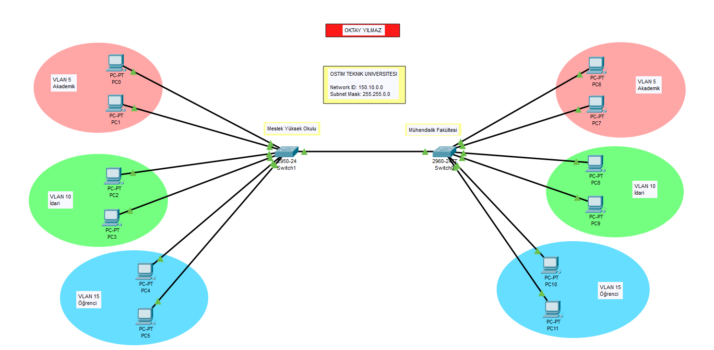
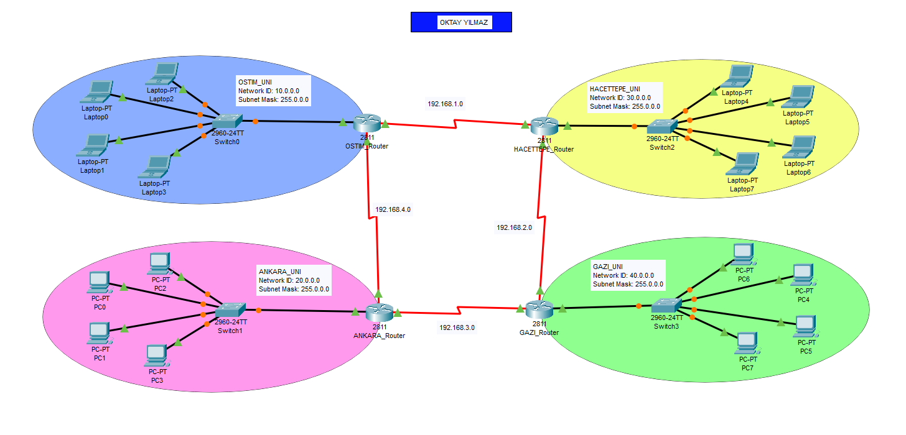
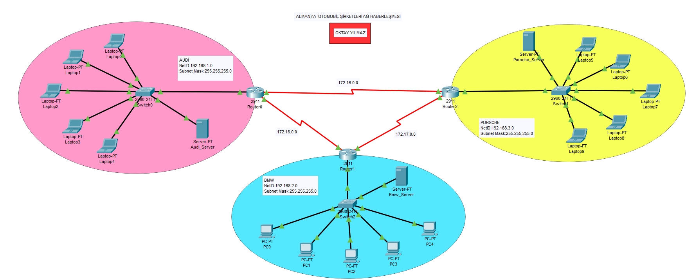

# Cisco Packet Tracer - Network Fundamentals & Security Labs

Bu depo, bir Siber Güvenlik Uzmanı adayı olarak ağ temellerini, veri trafiği yönetimini ve güvenli ağ yapılandırmalarını öğrenmek amacıyla gerçekleştirdiğim uygulamalı laboratuvar çalışmalarını içermektedir.

## 🚀 Proje İçerikleri

### 🏗 Lab 1: VLAN Yapılandırması (Segmentasyon ve Güvenlik)
Ağ trafiğini mantıksal olarak bölümlere ayırarak güvenliği ve performansı artırmayı amaçlayan çalışmadır.
- *Kapsam:* Switch üzerinde VLAN oluşturma, Access ve Trunk port yapılandırması.
- *Güvenlik Çıkarımı:* Farklı departmanların (Örn: İdari ve Öğrenci Ağı) birbirinden izole edilerek ağ güvenliğinin sağlanması.
- *Ağ Şeması:*

---
### 🛣 Lab 2: Router Yapılandırması (Inter-VLAN & Static Routing)
Farklı ağların ve VLAN'ların birbiriyle güvenli ve kontrollü bir şekilde haberleşmesini sağlayan yönlendirme çalışmasıdır.
- *Kapsam:* Router-on-a-Stick yapılandırması ve Statik Yönlendirme (Static Routing) protokolleri.
- *Teknik Detay:* Ağlar arası geçit (Gateway) yönetimi.
- *Ağ Şeması:*

---
### 📡 Lab 3: DHCP Yapılandırması (Otomatik IP Yönetimi)
Ağdaki cihazlara dinamik ve merkezi bir sistemle IP adresi dağıtımı çalışmasıdır.
- *Kapsam:* DHCP Pool oluşturma, Default Gateway ve DNS sunucu tanımlamaları.
- *Önem:* IP çakışmalarının önlenmesi ve ağ yönetiminin otomatize edilmesi.
- *Ağ Şeması:*

